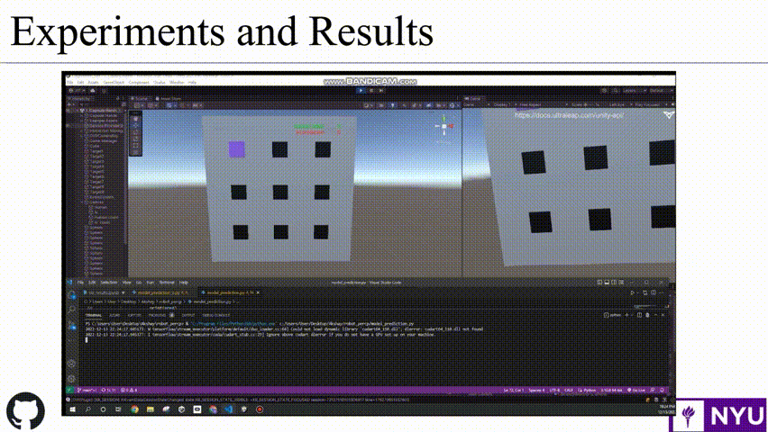

# VR based benchmarking of Fast Target Prediction Algorithms

Abstract - In recent years, the speed and accuracy of egocentric hand target prediction has proven to be vital in many areas
such as human-robot collaboration, assistive technology, and the
gaming industry. It is therefore crucial to benchmark target
prediction algorithms in terms of these metrics. We therefore
propose a non-application specific benchmarking method for
egocentric fast target prediction algorithms that is based on a
virtual reality whack-a-mole game. If the user touches the cube
(mole) before the target prediction algorithm predicts the cube,
the user wins a point, else the computer wins a point. The
game is therefore ideal for fast target prediction algorithms.
The game can be varied in terms of inter-target distance
analogous to objects at different locations. The virtual reality
(VR) environment allows for a standard testing methodology
due to its consistency and replicability. Apart from this, it
provides a more intuitive and interactive form of data collection.
The methodology is implemented on various target prediction
algorithms and is tested in real-time using data collected from
four users. Datasets are also created for offline training.

This respository contains the data and target prediction models used for the final project of the robot perception course at NYU. 

The repository also contains the VR environment developed on unity and interfaced with the occulus rift 2 headset mounted with the leap motion camera.

The folders are sturctured as shown below:  
1.  The folder [all_data](./all_data/) contains the data for the target prediction - both 3D target point prediction and target classification.
    - The folder [classification_1](./all_data/sep_1/) contains the data for the first target separation.
2. The folder [models](./models/) contains all the target prediction models.

The notebook [model_training.ipynb](./model_training.ipynb) is used for model training and [model_prediction.ipynb](./model_prediction.ipynb) is used for the predictions that are interfaced with unity.
